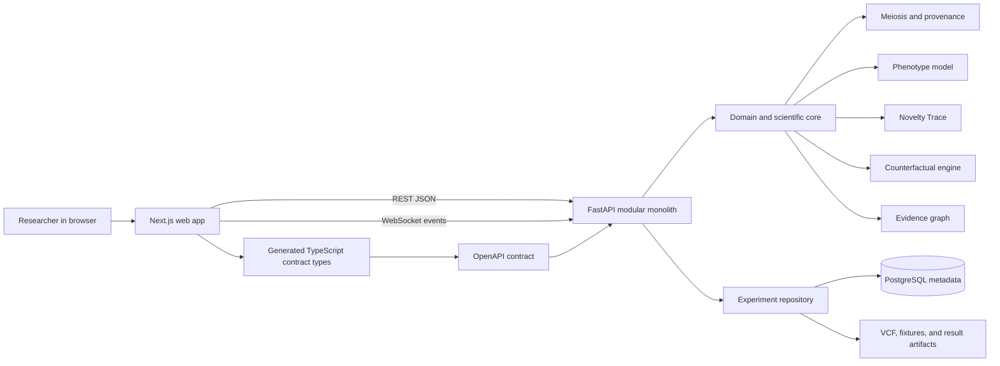
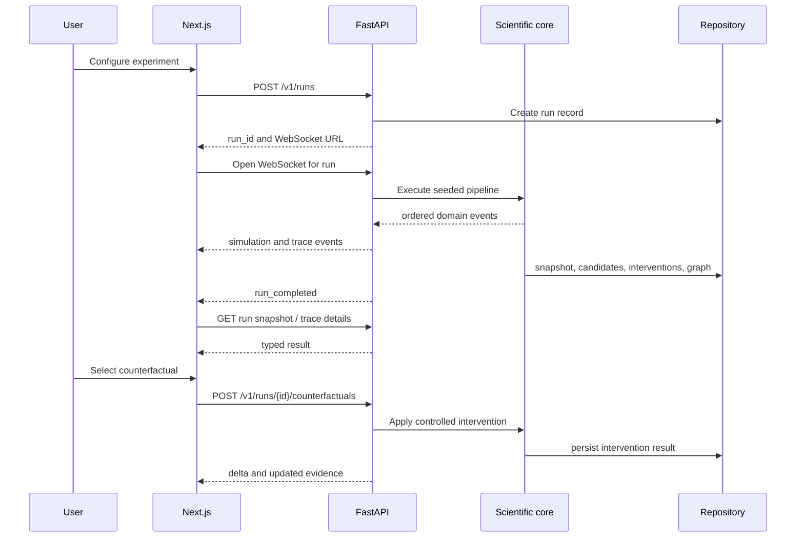

# Genetic Universe → Offspring Universe

## Master Architecture and Build Plan

Status: planning baseline for the hackathon MVP.

This document is the source of truth for the overall architecture. The detailed work is split into:

- common/PLAN.md — shared contracts, data formats, integration rules, and quality gates
- backend/PLAN.md — FastAPI API, scientific core, persistence, ingestion, and tests
- frontend/PLAN.md — Next.js application, visual experience, client state, and UI tests

The repository currently contains a Turborepo with apps/web, apps/docs, and shared packages. The plan extends it without coupling the scientific engine to the Next.js application.

## 1. Product goal

Build an explainable inheritance simulation that:

1. Represents two parents as phase-resolved homologous haplotypes.
2. Simulates or reconstructs meiotic recombination.
3. Preserves segment-level ancestry and crossover provenance.
4. Assembles an offspring genome.
5. Evaluates an interpretable synthetic phenotype model.
6. Detects when the offspring phenotype lies outside the parental range.
7. Traces the novelty to candidate inherited configurations and epistatic interactions.
8. Runs counterfactual interventions and reports phenotype deltas.
9. Renders an auditable Novelty Evidence Graph.

The hackathon product is a computational research framework. It is not a baby-trait predictor, clinical diagnostic system, reproductive decision tool, or proof of biological causality.

## 2. Architecture at a glance



### Architecture decisions

| Decision             | Choice                                                              | Reason                                                                                                                                          |
| -------------------- | ------------------------------------------------------------------- | ----------------------------------------------------------------------------------------------------------------------------------------------- |
| Backend shape        | Modular monolith                                                    | One deployable FastAPI service is easier to debug and demo than several microservices. Internal modules still keep scientific boundaries clean. |
| Frontend             | Existing apps/web Next.js app                                       | It is already present in the monorepo and is the right place for the interactive universe.                                                      |
| Scientific execution | Pure Python domain modules behind FastAPI                           | The browser should display scientific results, not implement the authoritative genetics calculations.                                           |
| Contract             | OpenAPI-first, versioned under packages/contracts                   | Backend and frontend can progress independently against the same schemas.                                                                       |
| REST data layer      | TanStack Query plus openapi-fetch                                   | openapi-fetch provides typed requests from the OpenAPI schema; TanStack Query manages caching, loading, retries, mutations, and invalidation.   |
| Live progress        | HTTP commands plus WebSocket event stream                           | HTTP is simple for commands and snapshots; WebSocket events drive the meiosis animation and trace timeline.                                     |
| MVP simulation       | Transparent custom simulator with an adapter boundary               | It is easier to explain and validate at 20–100 loci. An msprime/tskit adapter can be added later without changing the UI contract.              |
| Persistence          | PostgreSQL for metadata and audit logs; files for genomic artifacts | Genomic matrices and VCFs should not become millions of relational rows.                                                                        |
| MVP phenotype        | Deterministic, synthetic, interpretable model                       | Planted ground truth allows attribution metrics and avoids biological overclaiming.                                                             |
| ML                   | Deferred                                                            | A neural model would create a second explainability problem before the core pipeline is validated.                                              |

## 3. Target repository shape

```text
.
├── PLAN.md
├── backend/
│   └── PLAN.md
├── frontend/
│   └── PLAN.md
├── common/
│   └── PLAN.md
├── apps/
│   ├── web/                    # existing Next.js application
│   ├── docs/                   # existing Turborepo docs app
│   └── api/                    # planned Python FastAPI application
├── packages/
│   ├── contracts/              # OpenAPI, JSON examples, generated TS types
│   ├── ui/                     # existing shared UI package
│   ├── eslint-config/
│   └── typescript-config/
├── data/
│   ├── fixtures/               # small committed synthetic fixtures
│   ├── manifests/              # dataset metadata and checksums
│   ├── raw/                    # ignored downloads
│   └── prepared/               # ignored region-sliced artifacts
├── scripts/
│   ├── prepare-fixtures/
│   └── prepare-1000g/
└── docker-compose.yml          # planned API/database local environment
```

apps/api is a Python application and does not need to become a pnpm package. It should have its own pyproject.toml, lockfile, and test command. The OpenAPI contract remains language-neutral.

## 4. Runtime request and event flow



The frontend must not depend on internal Python modules, database tables, or raw VCF layout. It consumes only the contract and fixture formats.

## 5. MVP scope

### Must ship

- One synthetic experiment path with 20–100 loci.
- Two parental haplotype pairs.
- Seeded crossover simulation with explicit segment provenance.
- Offspring assembly with parent and homolog labels.
- A deterministic phenotype model containing additive and planted epistatic terms.
- Novelty detection outside the parental phenotype envelope.
- Candidate ranking.
- At least three interventions:
  - break an epistatic interaction
  - revert a candidate allele
  - swap a candidate segment
- Delta calculation and clear display.
- Evidence Graph with parent, homolog, crossover, segment, interaction, and phenotype nodes.
- Frontend mock mode using the same API response shapes.
- One real-data mode using one phased 1000 Genomes trio and a small chr22 region, with a synthetic phenotype model.
- A reproducible benchmark reporting planted-interaction recovery.

### Explicitly defer

- Whole-genome rendering.
- Clinical phenotypes or medical risk claims.
- A general-purpose human genotype-to-phenotype model.
- Exhaustive search over arbitrary variant subsets.
- Full 3,202-sample cohort analytics.
- Hail, distributed execution, and cloud orchestration.
- PyTorch as a core dependency.
- Exact biological crossover claims for real data.
- Multi-user authentication and production deployment.

## 6. Parallel build strategy

The backend and frontend may be built simultaneously, but they must share a contract from the beginning.

### Workstream A — common contract first

Create the initial OpenAPI and fixture contract before either side builds the full pipeline. Freeze the first version after the first vertical slice. Changes require updating both the example payloads and contract tests.

### Workstream B — backend in parallel

The backend first returns deterministic fixture-backed runs, then replaces the fixture implementation with the real scientific core behind the same endpoints. This lets frontend development start without waiting for simulation code.

### Workstream C — frontend in parallel

The frontend first uses mock transport and replayed events. The visual workflow, controls, and loading states are built before live scientific execution is connected.

### Workstream D — early integration checkpoints

Do not wait until every feature is complete. Connect in this order:

1. POST /v1/runs returns a run ID.
2. WebSocket replays a fixture event sequence.
3. Frontend renders a completed synthetic snapshot.
4. Backend replaces fixture events with the real custom simulator.
5. Counterfactual endpoint becomes live.
6. Real trio ingestion is added last.

## 7. Milestone plan

| Milestone          | Backend                                  | Frontend                                   | Shared exit condition                            |
| ------------------ | ---------------------------------------- | ------------------------------------------ | ------------------------------------------------ |
| M0: contract       | Define schemas, examples, event names    | Build API adapter and fixture loader       | Both sides compile against the same run fixture  |
| M1: shells         | FastAPI health and fixture run endpoints | App shell, setup form, analysis layout     | Mock mode can start and display a run            |
| M2: vertical slice | Synthetic simulation and snapshot        | Universe animation and phenotype cards     | One complete run renders from start to finish    |
| M3: trace          | Candidate mining and evidence graph      | Novelty Trace panel and graph view         | A planted A×B interaction is ranked and visible  |
| M4: counterfactual | Intervention endpoint and persistence    | Counterfactual lab and delta visualization | User can break A×B and see the phenotype change  |
| M5: real data      | Trio/VCF region adapter                  | Real Genome mode and disclosure text       | One real trio loads without changing the UI flow |
| M6: validation     | Metrics, determinism, error handling     | polish, accessibility, demo mode           | Demo is repeatable on a clean machine            |

## 8. Global definition of done

- A clean checkout can run the frontend in mock mode without the backend.
- A clean checkout can run the backend test suite without the frontend.
- The live frontend can create a run, receive events, render results, and request a counterfactual.
- All values shown in the UI are sourced from the run snapshot or event payload; no scientific value is fabricated in the UI.
- The same seed and model version produce the same logical result.
- The demo clearly labels synthetic phenotype data and computational attribution.
- No UI wording implies clinical diagnosis or biological proof.
- A failed simulation produces a useful error state and does not leave the UI stuck in loading.

## 9. Risks and controls

| Risk                                        | Control                                                                               |
| ------------------------------------------- | ------------------------------------------------------------------------------------- |
| Scope becomes a full genomics platform      | Keep the MVP to one trio, one region, 20–100 loci, and one phenotype model.           |
| Frontend waits for backend                  | Use contract fixtures and mock event replay from day one.                             |
| Backend and frontend disagree on shape      | OpenAPI versioning, generated types, and contract tests.                              |
| Animation hides missing science             | Require every visual state to map to an event or snapshot field.                      |
| Real VCF download is too large for the demo | Pre-slice one region and record checksum in a manifest.                               |
| Judges challenge causality claims           | Use “computational attribution” and “counterfactual evidence” consistently.           |
| Reproducibility breaks across environments  | Record seed, model version, code revision, dataset manifest, and environment version. |
